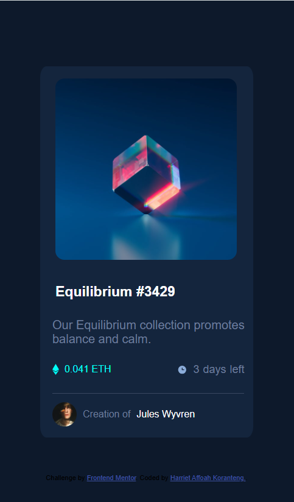
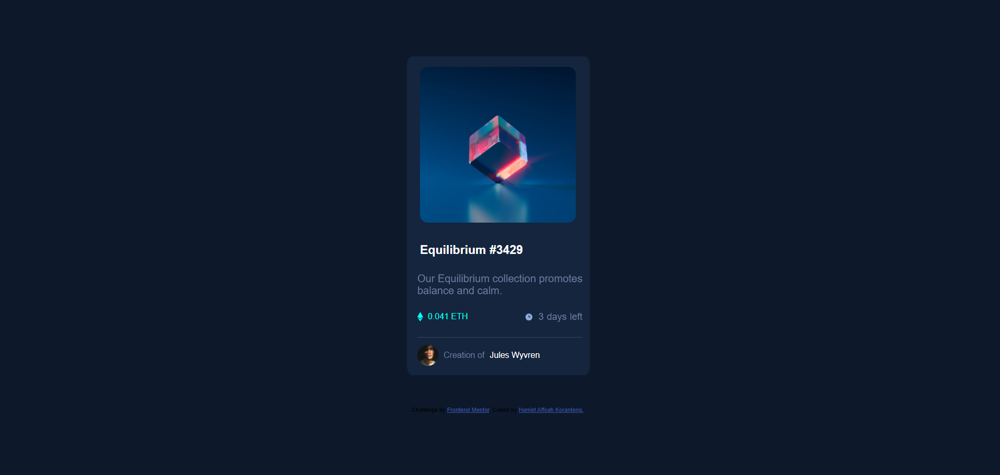

# Frontend Mentor - nft-preview-card solution

This is a solution to the [Nft preview card challenge on Frontend Mentor](https://www.frontendmentor.io/challenges/nft-preview-card-component-SbdUL_w0U). Frontend Mentor challenges help you improve your coding skills by building realistic projects. 

## Table of contents

- [Overview](#overview)
  - [Screenshot](#screenshot)
  - [Links](#links)
- [My process](#my-process)
  - [Built with](#built-with)
  - [What I learned](#what-i-learned)
  - [Continued development](#continued-development)
  - [Useful resources](#useful-resources)
- [Author](#author)
- [Acknowledgments](#acknowledgments)

## Overview

### Links

- Solution URL: [Add solution URL here](https://your-solution-url.com)
- Live Site URL: 

## My process

### Built with

- Semantic HTML5 markup
- CSS custom properties
- Flexbox
- CSS Grid

### What I learned
I learnt more css properties that i haven't heard of. I got to know box shadow and how it works.

### Continued development
I am hoping to get better at designing and creating more frontend and also be conversant with html, css.

## Author

- Frontend Mentor - [@Harriet-ops](https://www.frontendmentor.io/profile/Harriet-ops)
